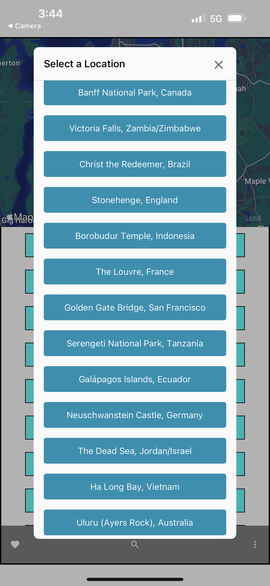
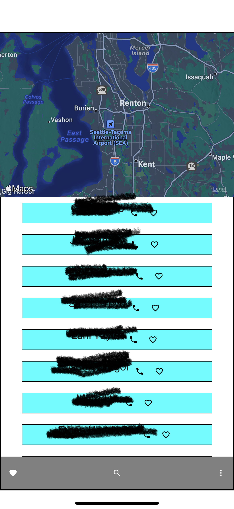

# mobileApp

## Phase one, lab 41
- Got a good start, manageed to get my Android emulator set up on my local machine. Ran into issues getting my VSCode and the android emulator talking. Jacob helped, it seems there is issues since I am on windows. 

- Finished lab assignment on the snack.expo.dev website since I wasnt able to host a local emulator, had to use the QR code they provide and my personal cell. Code inside this Repo is the same code I had on their site.

## Phase Two, Lab 42
- Created some new features on my mobile application. Got a map onto the app, added working contacts "Thanks to Jacobs demo code :D ", and also added a little pop up  that displays the different randomn locations I put into the code to choose from.

# Contributers: 
- David Danilchik
- Jaccob Knaack
- ChatGPT

